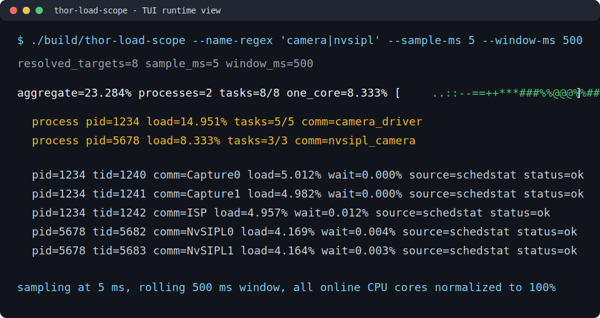

# thor-load-scope

Lightweight CPU load monitor prototype for NVIDIA Thor / DRIVE OS Ubuntu targets.

The MVP is intentionally UI-independent:

- reads `/proc/<pid>/task/<tid>/schedstat` when available
- falls back to `/proc/<pid>/task/<tid>/stat` when requested
- normalizes target CPU time against all online CPUs, so all cores combined are `100%`
- aggregates multiple processes into one combined load line
- writes CSV and prints a compact live terminal graph
- builds an optional Qt Widgets viewer when Qt5/Qt6 Widgets is available
- includes `tlscope-periodic-load` as a deterministic load fixture

The Qt viewer uses the same `tlscope_core` library as the CLI.

## TUI Preview



## Build on DRIVE OS / Ubuntu

```bash
cd thor-load-scope
cmake -S . -B build -DCMAKE_BUILD_TYPE=Release
cmake --build build -j
```

## Windows Smoke Build

The monitor is intended to run on DRIVE OS / Ubuntu, but the CLI target can be
compiled on Windows for local syntax and linkage checks. Use the repository
helper after installing the portable CMake and w64devkit toolchain under
`../tools/build`:

```powershell
powershell -ExecutionPolicy Bypass -File .\scripts\build-windows-smoke.ps1
.\build-win\thor-load-scope.exe --help
```

The script maps the workspace to a temporary ASCII drive letter before running
CMake, which avoids MinGW Make path issues when the checkout path contains
non-ASCII characters.

## Quick Start

List candidate threads:

```bash
./build/thor-load-scope --name-regex camera --list-targets
```

Monitor all threads in a process:

```bash
./build/thor-load-scope --pid 1234 --sample-ms 5 --window-ms 500 --csv camera_load.csv
```

Monitor multiple processes as one combined load:

```bash
./build/thor-load-scope --pid 1234 --pid 5678 --sample-ms 5 --window-ms 500 --aggregate-only
```

Monitor every process matched by name and show process subtotals:

```bash
./build/thor-load-scope --name-regex 'camera|nvsipl' --sample-ms 5 --window-ms 500
```

Capture the TUI on the target with a terminal screenshot tool and replace
`docs/images/tui-preview.svg` when an actual DRIVE OS runtime image is available.

Monitor one TID:

```bash
./build/thor-load-scope --pid 1234 --tid 1237 --sample-ms 5
```

Use the synthetic load fixture:

```bash
./build/tlscope-periodic-load --threads 1 --busy-ms 2 --period-ms 16.667 --duration-sec 30
```

Then monitor the printed PID/TID with `thor-load-scope`.

Launch the optional Qt viewer, when Qt Widgets is available:

```bash
./build/thor-load-scope-qt --pid 1234 --pid 5678 --sample-ms 5 --window-ms 500
```

Add `--csv-aggregate` to write combined rows in the CSV alongside per-thread samples.

## Current Scope

Implemented:

- procfs reader
- PID/TID resolver
- schedstat/stat fallback sampling
- online CPU normalization
- aggregate total across multiple processes
- per-process terminal subtotals
- CLI parser
- CSV writer
- compact terminal graph
- optional Qt Widgets rolling graph
- periodic busy-loop fixture

Not implemented yet:

- `/proc/interrupts` correlation panel
- cpuset denominator mode
- persistent UI settings

## Notes

`schedstat` field 1 is nanoseconds spent running on CPU. The displayed load is:

```text
100 * delta_exec_ns / (delta_wall_ns * online_cpu_count)
```

With 12 online CPUs, a single fully busy thread should read near `8.33%`.
